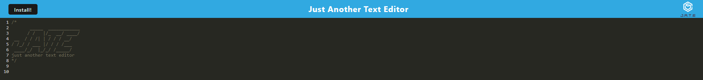

# Just Another Text Editor

## Description

This project is a clone of a text editor which allows users to type and save text and code snippets.
The technologies used in this project were:

- Node.js
- Nodemon
- IndexedDB Api
- Webpack
- Heroku

The challenge I had with this project which still hasn't been implemented was getting the header in the header.js to be precached when the application is opened.

## Usage

To use this project the user will just have to go onto the following url: https://myothertexteditor-10da5b79dcc1.herokuapp.com/
The landing page will look something like the following image:

Once in the application the user can type their text or code snippets either on the webpage or choose to install the applica tion onto their computer.
